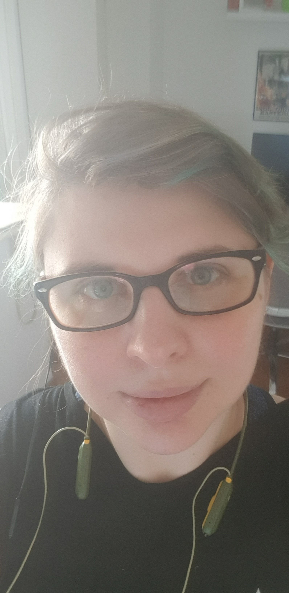

# Presentación

## Docente: Gise (Gisela Decuzzi)

Hola! Soy Gise, voy a estar molestando esporadicamente en la clase de Alf. Quizas sea mas esporadico de lo que a mi me gustaria pero bueno, las cosas pasan!
Me gusta mucho mucho programar y aprender cosas (si, asi de vago de todo!). Depende el momento las cosas pueden ser lettering, idiomas o un curso especifico de tests e2e con cypress.

Por fuera del multiverso programacion y afines disfruto mucho de unos buenos juegos de mesa si son eurogames a base de estrategia pues mejor! Sigo enojada con la pandemia porque nos arruino la campaña de Gloomhaven que veniamos haciendo con unos amigos ¿Ahora quien va a liberar la region?

Ultimamente mis pasatiempos favoritos vienen siendo hacer lettering de cosas, en este momento un libro nerdo que vengo leyendo (domain modeling desing made functional), cocinar, volver a pasar el zelda, hacer un podcast que tenemos desde hace un tiempito con varios amigos y salir a caminar por lugares sando fotos a lo que me llama la atencion ¿no sera muy osado lo mio? (no, creo que no!).

Cualquier cosa me escriben! Tardo en responder pero eventualmente respondo
